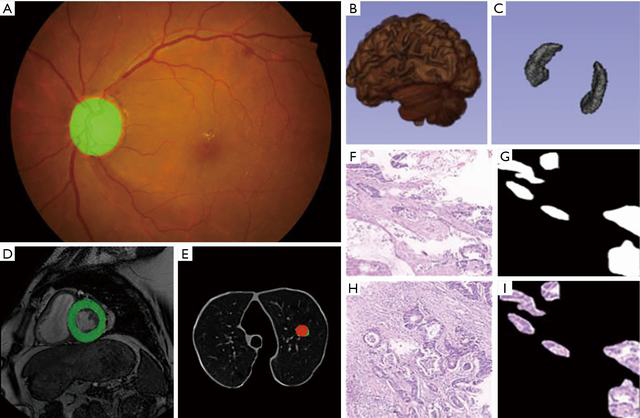
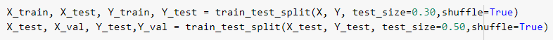
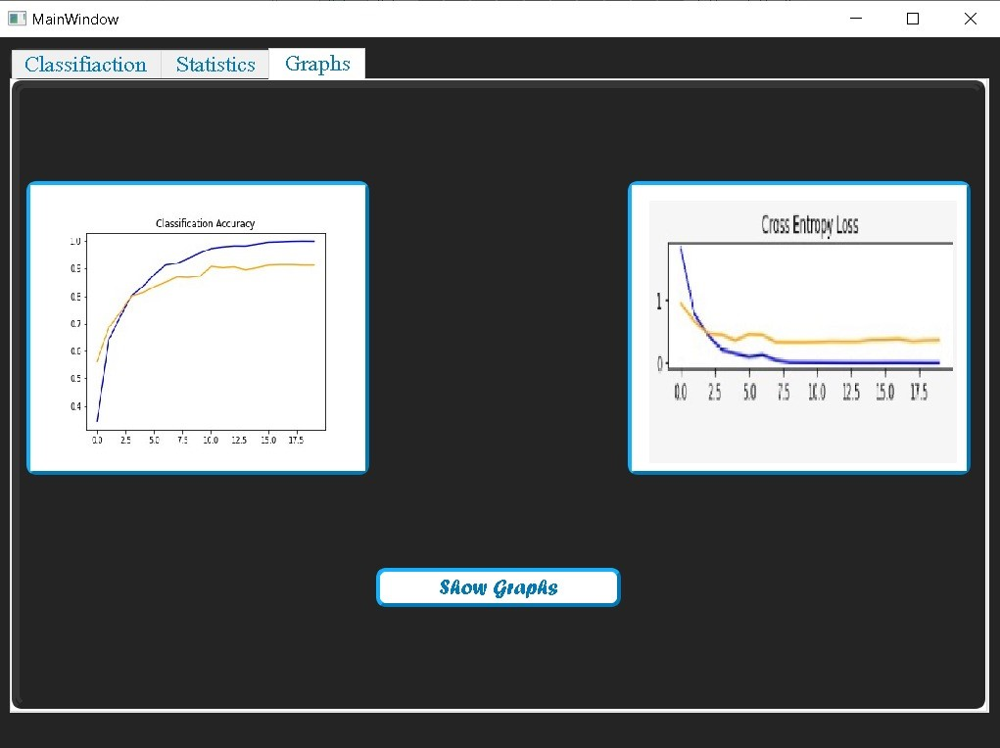

# **Image Classification**

**Students&#39; Names:**

Ahmed Mahmoud Fawzi 1170523

Amira Ahmed Noaman 1170400

Muhammed Ahmed Abd El-Monem 1170232

**Important Notes:**
To run the GUI and Enjoy the experience please download Models, and Data Folders from this [google drive link](https://drive.google.com/drive/folders/17xioDuMaR-CnERl3hjDephqWkY4WVWC6) and add them (unzipped) to the same directory.

**Introduction:**

Artificial Intelligence has been witnessing a monumental growth in bridging the gap between the capabilities of humans and machines. One of many such areas is the domain of Computer Vision, the agenda for this field is to enable machines to view the world as humans do, perceive it in a similar manner. The advancements in Computer Vision with Deep Learning have been constructed and perfected with time, primarily over one particular algorithm — a Convolutional Neural Network and this is the classifier we implemented in our project.

**Problem Definition:**

This project is mainly about dealing with Image Classification models. Image classification is one of the oldest and best-recognized Computer Vision (CV) tasks — it involves assigning a label with the name of the object class to a photo. Despite its apparent simplicity, this is a task that has caused enormous problems for researchers over the years.

**Importance:**

Image classification plays an important role in remote sensing images and is used for various applications such as environmental change, agriculture, land use/land planning, urban planning, surveillance, geographic mapping, disaster control, and object detection and definitely it attracted the medical researchers to use it in the medical field.

In recent years, various types of medical image processing and recognition have adopted deep learning methods, including fundus images, endoscopic images, CT/MRI images, ultrasound images, pathological images, etc.

The main method for studying related fundus diseases using deep learning techniques is to classify and detect fundus images, such as diabetic retinopathy detection and glaucoma detection. Not only fundus diseases, the current deep learning technology has achieved research results in the field of ultrasound imaging such as breast cancer, cardiovascular and carotid arteries too.

Figure 2 Deep learning application in medical image analysis. (A) Fundus detection; (B,C) hippocampus segmentation; (D) left ventricular segmentation; (E) pulmonary nodule classification; (F,G,H,I) gastric cancer pathology segmentation. The staining method is H&amp;E, and the magnification is ×40.

**Methodology:**

Convolutional Neural Networks (CNN) come under the subdomain of Machine Learning which is Deep Learning. Algorithms under Deep Learning process information the same way the human brain does, but obviously on a very small scale, since our brain is too complex (our brain has around 86 billion neurons).

**Why CNN for Image Classification?**

A Convolutional Neural Network (ConvNet/CNN) is a Deep Learning algorithm which can take in an input image, assign importance (learnable weights and biases) to various aspects/objects in the image and be able to differentiate one from the other. The pre-processing required in a ConvNet is much lower as compared to other classification algorithms.

A ConvNet is able to successfully capture the Spatial and Temporal dependencies in an image through the application of relevant filters. The architecture performs a better fitting to the image dataset due to the reduction in the number of parameters involved and reusability of weights. In other words, the network can be trained to understand the sophistication of the image better.

The role of the ConvNet is to reduce the images into a form which is easier to process, without losing features which are critical for getting a good prediction so let&#39;s explain the process in details.

**CNN Architecture:**

1. **Kernel/Filter Size** : A filter is a matrix of weights with which we convolve on the input. The filter on convolution, provides a measure for how close a patch of input resembles a feature. A feature may be vertical edge or an arch, or any shape. The weights in the filter matrix are derived while training the data. Smaller filters collect as much local information as possible, bigger filters represent more global, high-level and representative information. The filter sizes we chose were (3,3)

2. **Padding** : Padding is generally used to add columns and rows of zeroes to keep the spatial sizes constant after convolution, doing this might improve performance as it retains the information at the borders, to set this parameter in keras we set it with &quot;Same&quot;. On the other hand, if we perform the same operation without padding, we are presented with a matrix which has dimensions of the Kernel (3x3x1) itself — Valid Padding We used the 2 padding types

3. **Number of Channels** : It is the equal to the number of color channels for the input but in later stages is equal to the number of filters we use for the convolution operation. The more the number of channels, more the number of filters used, more are the features learnt, and more is the chances to over-fit and vice-versa.

4 **. Pooling-layer Parameters** : Pooling layers too have the same parameters as a convolution layer. **Max-Pooling** is generally used among all the pooling options. The objective is to down-sample an input representation (image, hidden-layer output matrix, etc.), reducing its dimensionality by keeping the max value(activated features) in the sub-regions binned.

**PRACTICAL: Step by Step Guide**

We chose to work on Google Colab and we connected the dataset through google drive, so the code we provided here should work if the same setup is being used.

**Step 1: Chosen Dataset**

We chose to work on the dataset provided here: [http://www.vision.caltech.edu/Image_Datasets/Caltech101/](http://www.vision.caltech.edu/Image_Datasets/Caltech101/)

Pictures of objects belonging to 101 categories. About 40 to 800 images per category. Most categories have about 50 images. We chose 11 categories where most of the files contained about 50 images and only 2 categories with 200 images and we fixed this using Data Augmentation which will be explained in the next step.

We chose to work on the colored images without converting it to grayscale since we believe that the colors will help in the classification. For example, a colorful butterfly would be obviously different than the bonsai images which are mostly green.

**Step 2: Prepare Dataset for Training**

1. The first step we did was to resize the images to be 300x300, they had different dimensions so we made sure to unify their sizes for an easier processing
2. The next step was the **data augmentation** , with about 1000 images, the data set was too small to get better results from the implemented CNN. We decided to increase the dataset by doing augmentation process. In the Augmentation process, we read each image and generate 3 more images from it. The 3 extra images are image with a different brightness level from the original, the second was rotated at a different angle, and the third was flipped horizontally. We then saved these new images and read the new data set.
3. Normalization is the 3rd step where we divide by 255 so we get data between 0 and , this is done for saving computational power.
4. The last step in the preprocessing is defining the labels where we set a number for each category and prepare the label array by applying one-hot encoding  each integer value is represented as a binary vector that is all zero values except the index of the integer, which is market with a 1. This allows the representation of the categorical data to be more expressive and this makes the problem easier for the network to model.

**Step 3: Split X and Y to training, validation &amp; testing:**

According to the requirements, we split the data into 70% training, 15% testing and 15% for validation. If we run this cell another time the data will be shuffled and this will help us while trying different models in order to avoid overfitting, This is done using this line of code:

After that, we save the train, test and validation data to the Google drive in order to load them later on directly without the need to run the training step each time we try a new model  this saves the computational power since we don&#39;t have enough sources for this.

**Step 4: Define, compile and train the CNN model**

Now, we&#39;re ready to prepare the CNN model and test with our data.

Our model architecture consists of 3 convolutional layers with filter numbers of [128, 256, 512] and filter size of (3,3) and as mentioned before we used maxpooling of size (2,2). The padding types we used was &quot;Same&quot; for the first 2 conv layers and valid for the last one. This means that in the beginning of the training we look to the picture as a whole, caring about the borders and so on then we focus on the middle of the image.

We have one hidden layer with 512 filters and we added dropouts to avoid overfitting.

**Why use Relu Activation function?**

- It overcomes the vanishing gradient problem, allowing models to learn faster and perform better.
- It&#39;s considered the default activation when developing multilayer Perceptron and convolutional neural networks.

**Why use Softmax in the output layer?**

The softmax function will output a probability of class membership for each class label and attempt to best approximate the expected target for a given input.

For example, if the integer encoded class 1 was expected for one example, the target vector would be: [0, 1, 0]

The softmax output might look as follows, which puts the most weight on class 1 and less weight on the other classes. [0.09003057 0.66524096 0.24472847]

The error between the expected and predicted multinomial probability distribution is often calculated using cross-entropy, and this error is then used to update the model. This is called the cross-entropy loss function.  And this is the loss function we used.

**Step 8: Comparison with open-source visual classifier**

The last step we did was about comparing our model with an open-source visual classifier which is widely known, it&#39;s called &quot;AlexNet&quot;. We searched for its model that is applied on a similar dataset like ours and tested their model on our data. The difference between them is not only the architecture, but also the optimizer used, ours is: **Adam** and AlexNet is **SGD** , number of epochs in ours is 20, AlexNet 50. Batch size in ours is 50 and AlexNet is 32. We applied callbacks in our model which is ReduceLRonPlateau but in AlexNet no callbacks were used.

The Alexnet produced higher accuracy compared to our model and this may be due to the difference of optimizer and number of layers.

**Bonus Part: GUI**

Using PyQt we created a representative GUI for the users to try the different models we used (our model, AlexNet) for a nicer and easier display. You can find the code attached too and you can run it simply like you run any python file. This GUI allows the user to choose which model to test, then choose a picture and check for its prediction plus it can view the accuracy, recall, precision, MSE, MAE and F1 score for the testing dataset. We also provided screenshots of this GUI in the report.

**Experimental Results and discussions:**

We believe that maybe because of the different optimizer used, the AlexNet accuracy is better than ours and also required less training time.

**Training Time for our model =** 19.5 min.

**AlexNet Training time =** 9 min.

Optimizers Used:
**Our Model : Adam**

We used this optimizer based on the following reasons:

- Adam combines the best properties of the AdaGrad and RMSProp algorithms to provide an optimization algorithm that can handle sparse gradients on noisy problems and our pictures have different features/noise so it would be helpful
- Adam is relatively easy to configure where the default configuration parameters do well on most problems

**AlexNet Model: Stochastic gradient descent**

Benefits of SGD:

1. It is easier to fit into memory due to a single training sample being processed by the network
2. It is computationally fast as only one sample is processed at a time
3. For larger datasets it can converge faster as it causes updates to the parameters more frequently
4. Due to frequent updates the steps taken towards the minima of the loss function have oscillations which can help getting out of local minimums of the loss function (in case the computed position turns out to be the local minimum)

**Metrics that we calculated for our models**

**Accuracy** : equal to the fraction of predictions that a model got right.

- Model Accuracy for our model: **94.62%**
- Model Accuracy for AlexNet model: **97.07 %**

**Mean Squared Error (MSE):** The MSE is a measure of the quality of an estimator — it is always non-negative, and values closer to zero are better.

- MSE for our Model: 1.72
- MSE for AlexNet: 0.61

**Mean Absolute Error (MAE):** In statistics, mean absolute error (MAE) is a measure of errors between paired observations expressing the same phenomenon. Values closer to zero are better.

- MAE for our Model: 0.264 - MAE for AlexNet: 0.12

**Graphs for accuracy &amp; loss during training of our model:**

- Blue -> Training
- Yellow -> Validation

**Accuracy for each Category:**

- **Our Model:**

Accuracy of Bonsai: 0.9907692307692307

Accuracy of Brain: 0.9892307692307692

Accuracy of Butterfly: 0.9876923076923076

Accuracy of Chandelier: 0.9846153846153847

Accuracy of Grand Piano: 0.9984615384615385

Accuracy of Hawks Bill: 0.9892307692307692

Accuracy of Helicopter: 0.9861538461538462

Accuracy of Ketch: 0.9953846153846154

Accuracy of Leaopards: 0.9969230769230769

Accuracy of Starfish: 0.9892307692307692

Accuracy of Watch: 0.9846153846153847

- **AlexNet Model:**

Accuracy of Bonsai: 0.9923076923076923

Accuracy of Brain: 0.9969230769230769

Accuracy of Butterfly: 0.9938461538461538

Accuracy of Chandelier: 0.9907692307692307

Accuracy of Grand Piano: 1.0

Accuracy of Hawks Bill: 0.9892307692307692

Accuracy of Helicopter: 0.9953846153846154

Accuracy of Ketch: 0.9969230769230769

Accuracy of Leaopards: 0.9984615384615385

Accuracy of Starfish: 0.9953846153846154

Accuracy of Watch: 0.9923076923076923

**Precision** : attempts to answer &quot;What proportion of positive identifications was actually correct?&quot;

- **Our model:**

Precison of Bonsai: 0.9571428571428572

Precison of Brain: 0.9206349206349206

Precison of Butterfly: 0.8913043478260869

Precison of Chandelier: 0.8888888888888888

Precison of Grand Piano: 1.0

Precison of Hawks Bill: 0.9444444444444444

Precison of Helicopter: 0.9361702127659575

Precison of Ketch: 0.9743589743589743

Precison of Leaopards: 0.967741935483871

Precison of Starfish: 0.9473684210526315

Precison of Watch: 0.9803921568627451

- **AlexNet model:**

Precison of Bonsai: 0.9577464788732394

Precison of Brain: 0.967741935483871

Precison of Butterfly: 0.9761904761904762

Precison of Chandelier: 0.96875

Precison of Grand Piano: 1.0

Precison of Hawks Bill: 0.9444444444444444

Precison of Helicopter: 0.9795918367346939

Precison of Ketch: 1.0

Precison of Leaopards: 0.9836065573770492

Precison of Starfish: 0.9508196721311475

Precison of Watch: 0.95

**Comments:**

1. The Mean Square Error of the AlexNet model is much smaller than our model and this indicates that the quality of our classifier needs some extra effort to be better and to become closer to AlexNet.
2. Although the category accuracy of our model is very high reaching 98 and 99%, AlexNet reached higher accuracies for each category.
3. The categories with the least accuracy in our model was the chandelier and the watch and we believe that this is normal since both of these categories have multiple colors and designs, which may confuse the classifier. Although most of the watches were circular but this shape is common with other categories for example it can get mixed with the brain shape. Also, the chandeliers have various shapes and also the color of the background may affect the classification. Here are some of the images that might be confusing:
   
   

**Appendix with codes:**

# Pattern Recognition Final Project

### Ahmed Mahmoud Fawzi ID:1170523

### Amira Ahmed Adel ID:1170400

### Mohammed Ahmed Abd El-Monem ID:1170232

#

import os

import sys

import cv2

import matplotlib.pyplot as plt

from os import listdir

import csv

from PIL import Image as PImage

from sklearn.cluster import KMeans

import numpy as np

from keras.layers import Activation

from keras import optimizers

import random

import tensorflow as tf

import matplotlib.pyplot as pyplot

import pandas as pd

from tensorflow.keras.callbacks import EarlyStopping

from tensorflow.keras.layers import Conv2D

from tensorflow.keras.layers import Dense,MaxPool2D,Flatten,Dropout

from tensorflow.keras.models import Sequential

from numpy import asarray

from sklearn.model_selection import train_test_split

from tensorflow.keras import layers

from tensorflow import keras

from keras.utils import np_utils

from keras.models import Sequential

from keras.regularizers import l2

import argparse

from keras.layers.convolutional import Convolution2D, MaxPooling2D ,Conv2D,ZeroPadding2D

from keras.layers.normalization import BatchNormalization

from keras.layers.core import Dense, Dropout, Activation, Flatten

from tensorflow.keras.optimizers import RMSprop

from keras.optimizers import Adam

from keras.optimizers import SGD

from sklearn.utils import shuffle

import os

from numpy import expand_dims

from keras.preprocessing.image import load_img

from keras.preprocessing.image import img_to_array

from keras.preprocessing.image import ImageDataGenerator

from matplotlib import pyplot

from sklearn.metrics import accuracy_score

from sklearn.metrics import recall_score

from sklearn.metrics import precision_score

from sklearn.metrics import f1_score

from sklearn.metrics import mean_squared_error

from sklearn.metrics import mean_absolute_error

from keras.callbacks import ReduceLROnPlateau

from sklearn.metrics import confusion_matrix

from google.colab import drive

drive.mount(&#39;/content/drive&#39;)

# # Functions Definition

# Load Paths

# this function serves to load the paths for the .jpg images in the folder

def load_paths(Y_data):

    PatternPath =&#39;/Users/modyf/Desktop/Pattern Final/DataSet/&#39;

    filesJPG = []  # create an empty list

    for dirName, subdirList, fileList in os.walk(PatternPath):

        namedir=None

        for filename in fileList:

            Y\_data.append(os.path.basename(os.path.normpath(dirName)))

            if &quot;.jpg&quot; in filename.lower():

                namedir=[os.path.splitext(filename)[0],os.path.join(dirName,filename)]

                filesJPG.append(namedir)

    #return an array containing the paths

    return filesJPG

# Read Iamges

# this function reads all the images from the given array of paths it reads the images and sets them in an array X_data

def Read(filenameDCM):

    # a temp loaded picture so that we could intialize the tyoe of the array we are creating and the size

    temp = cv2.imread(filenameDCM[0][1])

    temp = cv2.cvtColor(temp, cv2.COLOR\_BGR2RGB)

    x=300

    y=300

    z=3

    ConstPixelDims = (x, y,z, len(filenameDCM))

    images=[]

    dim = (x, y)

    # itializing the X\_Data array

    X\_data = np.zeros(len(filenameDCM)\*x\*y\*z,dtype=temp.dtype)

    print(temp.dtype)

    # reshaping the X\_data array to be (totalpicsize,300,300,3)

    X\_data=np.reshape(X\_data,(len(filenameDCM),x,y,z))

    # a temp array created to load pics

    new\_array = np.zeros(ConstPixelDims, dtype=temp.dtype)

    # Loop across all the paths and then read the imamges

    for i in range(len(filenameDCM)):

        # Read the Image

        img = cv2.imread(filenameDCM[i][1])

        img = cv2.cvtColor(img, cv2.COLOR\_BGR2RGB)

        # Resize all immages to a fixed size 300\*300

        img=cv2.resize(img, dim, interpolation = cv2.INTER\_AREA)

        new\_array[:, :,:, i] = img

        X\_data[i] = new\_array[:,:,:,i]

    # return the X\_Data array

    return X\_data

# Augment Images Function

# This function serves to make Audmentation for the Images to increase the dataset

def AugmentImages_Save(X_data):

    # an array with the current size of data iamges

    arr=[128,98,91,107,99,100,88,114,200,86,239]

    c=0

    k=0

    c=arr[k]

    ind=c

    os.mkdir(str(ind))

    check=0

    # loop accross the all the images in X\_data array we created

    for j,data in enumerate(X\_data):

        #  if we reached the same number as the current size of images in the arr ( this means we have looped accross all images of category 1 for exampel)

        if check==arr[k]:

            k+=1

            # reupdate the c so that we could rename images automaticaly

            c=arr[k]

            ind=c

            # create a directory for the new category images

            os.mkdir(str(ind))

            check=0

        # for this part we create an image with different brightness from the passed image

        samples = expand\_dims(data, 0)

        datagen = ImageDataGenerator(brightness\_range=[0.6,1.5])

        it = datagen.flow(samples, batch\_size=2)

        for i in range(1):

            batch = it.next()

            image = batch[0].astype(&#39;uint8&#39;)

            # save the new image

            c=c+1

            num=&quot;%04d&quot; % (c)

            cv2.imwrite(str(ind)+&quot;/image\_&quot;+num.strip()+&quot;.jpg&quot;, image)

        # for this part we create a new rotated image different from the passed image

        datagen = ImageDataGenerator(rotation\_range=45)

        it = datagen.flow(samples, batch\_size=1)

        for i in range(1):

            batch = it.next()

            image = batch[0].astype(&#39;uint8&#39;)

            # save the new image

            c=c+1

            num=&quot;%04d&quot; % (c)

            cv2.imwrite(str(ind)+&quot;/image\_&quot;+num.strip()+&quot;.jpg&quot;, image)

        # for this part we create a new flipped image different from the passed image

        datagen = ImageDataGenerator(horizontal\_flip=True)

        it = datagen.flow(samples, batch\_size=1)

        for i in range(1):

            batch = it.next()

            image = batch[0].astype(&#39;uint8&#39;)

            # save the new image

            c=c+1

            num=&quot;%04d&quot; % (c)

            cv2.imwrite(str(ind)+&quot;/image\_&quot;+num.strip()+&quot;.jpg&quot;, image)

        check+=1

# Normalize Function

# Normalize the Data Function we normalize the data to be in range 0-1 as the min x is 0 and the max is 255 so we divide all elements

# by 255 making the range 0-1

def NormalizeData(X):

    print(&quot;X min Before:&quot;, np.min(X))

    print(&quot;X max Before:&quot;, np.max(X))

    X = X.astype(&#39;float32&#39;)

    X /= 255

    print(&quot;X min After:&quot;, np.min(X))

    print(&quot;X max After:&quot;, np.max(X))

    return X

# Transform Labels Function

# this function serves to transform the class labels to 0,1,3,4,5,6,7,8,9,10

def TransformLabels(Y_data):

    for i in range(len(Y\_data)):

        if Y\_data[i]==&quot;bonsai&quot;:

            Y\_data[i]=0

        elif Y\_data[i]==&quot;brain&quot;:

            Y\_data[i]=1

        elif Y\_data[i]==&quot;butterfly&quot;:

            Y\_data[i]=2

        elif Y\_data[i]==&quot;chandelier&quot;:

            Y\_data[i]=3

        elif Y\_data[i]==&quot;grand\_piano&quot;:

            Y\_data[i]=4

        elif Y\_data[i]==&quot;hawksbill&quot;:

            Y\_data[i]=5

        elif Y\_data[i]==&quot;helicopter&quot;:

            Y\_data[i]=6

        elif Y\_data[i]==&quot;ketch&quot;:

            Y\_data[i]=7

        elif Y\_data[i]==&quot;Leopards&quot;:

            Y\_data[i]=8

        elif Y\_data[i]==&quot;starfish&quot;:

            Y\_data[i]=9

        elif Y\_data[i]==&quot;watch&quot;:

            Y\_data[i]=10

# Shuffle Fucntion

# This functions serves to shuffle your data if needed as the computational cost is high if every time a new split for the X_data is done

# so if we have all the X_train,Y_train,X_test,Y_test,X_val,Y_val data saved already we just load them and call this fucntion

def Reshuffle(X_train,Y_train,X_test,Y_test,X_val,Y_val):

    # Shuffle the data and then returning them

    X\_train,Y\_train = shuffle(X\_train, Y\_train)

    X\_test,Y\_test = shuffle(X\_test, Y\_test)

    X\_val,Y\_val = shuffle(X\_val, Y\_val)

    return X\_train,Y\_train,X\_test,Y\_test,X\_val,Y\_val

# Graph Diagnostics Function

# This Function save 2 graphs for Cross Entropy Loss and for Classification Accuracy

def Graph_diagnostics(history):

    # Cross Entropy Loss

    pyplot.subplot(311)

    pyplot.title(&#39;Cross Entropy Loss&#39;)

    pyplot.plot(history.history[&#39;loss&#39;], color=&#39;blue&#39;, label=&#39;train&#39;)

    pyplot.plot(history.history[&#39;val\_loss&#39;], color=&#39;orange&#39;, label=&#39;test&#39;)

    filename = sys.argv[0].split(&#39;/&#39;)[-1]

    pyplot.savefig(filename +&quot;1&quot; &#39;\_plot.png&#39;)

    #Classification Accuracy

    pyplot.subplot(313)

    pyplot.title(&#39;Classification Accuracy&#39;)

    pyplot.plot(history.history[&#39;accuracy&#39;], color=&#39;blue&#39;, label=&#39;train&#39;)

    pyplot.plot(history.history[&#39;val\_accuracy&#39;], color=&#39;orange&#39;, label=&#39;test&#39;)

    # save plot to file

    filename = sys.argv[0].split(&#39;/&#39;)[-1]

    pyplot.savefig(filename +&quot;2&quot; &#39;\_plot.png&#39;)

# Show and Predict Function

# This function serves to predict the passed X_test image and then shows and print the prediction

def Show_and_Predict(X_test):

    labels\_dic = {

            0: &quot;Bonsai&quot;,

            1: &quot;Brain&quot;,

            2: &quot;Butterfly&quot;,

            3: &quot;Chandelier&quot;,

            4: &quot;Grand Piano&quot;,

            5: &quot;Hawks Bill&quot;,

            6: &quot;Helicopter&quot;,

            7: &quot;Ketch&quot;,

            8: &quot;Leaopards&quot;,

            9: &quot;Starfish&quot;,

            10: &quot;Watch&quot;,

        }

    X\_pred=np.reshape(X\_test,(1, X\_test.shape[0], X\_test.shape[1], 3))

    ypred=model.predict(X\_pred)

    y\_pred=np.argmax(ypred, axis = 1)

    plt.imshow(X\_test)

    print(labels\_dic[int(y\_pred)])

# Print Statistics Function

# This Function Prints the Statitics of the model

def Statistics(Y_test\_,y_pred):

    labels\_dic = {

            0: &quot;Bonsai&quot;,

            1: &quot;Brain&quot;,

            2: &quot;Butterfly&quot;,

            3: &quot;Chandelier&quot;,

            4: &quot;Grand Piano&quot;,

            5: &quot;Hawks Bill&quot;,

            6: &quot;Helicopter&quot;,

            7: &quot;Ketch&quot;,

            8: &quot;Leaopards&quot;,

            9: &quot;Starfish&quot;,

            10: &quot;Watch&quot;,

        }

    ## Print the Accuracy Score

    print(&quot;Classification Accuracy Score: &quot;, accuracy\_score(Y\_test\_, y\_pred))

    print(&quot;---&quot;)

    ## Print the Recall of the classes

    recall\_of\_classes = (recall\_score(Y\_test\_, y\_pred, average=None))

    for index, recall in enumerate(recall\_of\_classes):

        print(&quot;Recall of {}:&quot;.format(labels\_dic[index]), recall)

    print(&quot;---&quot;)

    ## Print the Precision of the classes

    precision\_of\_classes = (precision\_score(Y\_test\_, y\_pred, average=None))

    for index, perc in enumerate(precision\_of\_classes):

        print(&quot;Precison of {}:&quot;.format(labels\_dic[index]), perc)

    print(&quot;---&quot;)

    ## Print the F1 of the classes

    f1\_of\_classes = (f1\_score(Y\_test\_, y\_pred, average=None))

    for index, f1 in enumerate(f1\_of\_classes):

        print(&quot;F1 of {}:&quot;.format(labels\_dic[index]), f1)

    print(&quot;---&quot;)

    ## Print the Mean Squared Error

    mse=mean\_squared\_error(Y\_test\_, y\_pred)

    print(&quot;Mean\_Squared\_Error:&quot;, mse)

    print(&quot;---&quot;)

    ## Print the Mean Absolute Error

    mae=mean\_absolute\_error(Y\_test\_, y\_pred)

    print(&quot;Mean\_Absolute\_Error: &quot;, mae)

    print(&quot;---&quot;)

    # Get the confusion matrix

    cm = confusion\_matrix(Y\_test\_, y\_pred)

    # We will store the results in a dictionary for easy access later

    per\_class\_accuracies = {}

    # Calculate the accuracy for each one of our classes

    for idx, cls in enumerate([0, 1, 2, 3, 4, 5, 6, 7, 8, 9, 10]):

        # True negatives are all the samples that are not our current GT class (not the current row)

        # and were not predicted as the current class (not the current column)

        true\_negatives = np.sum(np.delete(np.delete(cm, idx, axis=0), idx, axis=1))

        # True positives are all the samples of our current GT class that were predicted as such

        true\_positives = cm[idx, idx]

        # The accuracy for the current class is ratio between correct predictions to all predictions

        per\_class\_accuracies[cls] = (true\_positives + true\_negatives) / np.sum(cm)

    key\_list = [&quot;Bonsai&quot;, &quot;Brain&quot;, &quot;Butterfly&quot;, &quot;Chandelier&quot;, &quot;Grand Piano&quot;, &quot;Hawks Bill&quot;, &quot;Helicopter&quot;, &quot;Ketch&quot;, &quot;Leaopards&quot;, &quot;Starfish&quot;, &quot;Watch&quot;]

    val\_list = list(per\_class\_accuracies.values())

    dictionary = dict(zip(key\_list, val\_list))

    for index, accuracy in enumerate(val\_list):

        print(&quot;Accuracy of {}:&quot;.format(key\_list[index]), accuracy)

    print(&quot;---&quot;)

# Pre-Processing Data

# Load , Read Images , and Save X_Data array to save time later

Y_data=[]

filesJPG=load_paths(Y_data)

TransformLabels(Y_data)

Y_data=np.asarray(Y_data)

X_data=Read(filesJPG)

AugmentImages_Save(X_data)

filesJPG=load_paths()

X_data=Read(filesJPG)

np.save(&#39;X_data&#39;,X_data,allow_pickle=False,fix_imports=False)

np.save(&#39;Y_data&#39;,Y_data,allow_pickle=False,fix_imports=False)

X_data=[]

Y_data=[]

# Load X_data and Y_data from the saved .npy files

X_data = np.load(&#39;X_data.npy&#39;, mmap_mode=&#39;r&#39;)

Y = np.load(&#39;Y_data.npy&#39;, mmap_mode=&#39;r&#39;)

Y=Y.reshape(-1,1)

# Normalizing the X_data

X=NormalizeData(X_data)

# Splitting the X_data and Y_data into X_train,Y_train,X_test,Y_test,X_val,Y_val

X_train, X_test, Y_train, Y_test = train_test_split(X, Y, test_size=0.30,shuffle=True)

X_test, X_val, Y_test,Y_val = train_test_split(X_test, Y_test, test_size=0.50,shuffle=True)

# Making One-Hot encoding for the Labels

Y_train = np_utils.to_categorical(Y_train)

Y_test = np_utils.to_categorical(Y_test)

Y_val= np_utils.to_categorical(Y_val)

# Saving all the data created as .npy files to later process faster and save computational power

np.save(&#39;X_train&#39;,X_train,allow_pickle=False,fix_imports=False)

np.save(&#39;X_test&#39;,X_test,allow_pickle=False,fix_imports=False)

np.save(&#39;Y_train&#39;,Y_train,allow_pickle=False,fix_imports=False)

np.save(&#39;Y_test&#39;,Y_test,allow_pickle=False,fix_imports=False)

np.save(&#39;X_val&#39;,X_val,allow_pickle=False,fix_imports=False)

np.save(&#39;Y_val&#39;,Y_val,allow_pickle=False,fix_imports=False)

# Code May Now Start From Here Directly

# Loading the saved .npy files

X_train = np.load(&#39;/content/drive/MyDrive/Best Model 2/X_train.npy&#39;, mmap_mode=&#39;r&#39;)

X_test = np.load(&#39;/content/drive/MyDrive/Best Model 2/X_test.npy&#39;, mmap_mode=&#39;r&#39;)

X_val = np.load(&#39;/content/drive/MyDrive/Best Model 2/X_val.npy&#39;, mmap_mode=&#39;r&#39;)

Y_test = np.load(&#39;/content/drive/MyDrive/Best Model 2/Y_test.npy&#39;, mmap_mode=&#39;r&#39;)

Y_train = np.load(&#39;/content/drive/MyDrive/Best Model 2/Y_train.npy&#39;, mmap_mode=&#39;r&#39;)

Y_val = np.load(&#39;/content/drive/MyDrive/Best Model 2/Y_val.npy&#39;, mmap_mode=&#39;r&#39;)

# Reshuffle the data if needed

X_train,Y_train,X_test,Y_test,X_val,Y_val=Reshuffle(X_train,Y_train,X_test,Y_test,X_val,Y_val)

# CNN Model Create

model = Sequential()

# 1st conv block

model.add(Conv2D(128, (3, 3), padding =&quot;same&quot;, input_shape=(300, 300, 3)))

model.add(MaxPool2D(pool_size=(2, 2), padding=&#39;same&#39;))

# 2nd conv block

model.add(Conv2D(256, (3, 3), activation=&#39;relu&#39;, strides=(2, 2), padding=&#39;same&#39;))

model.add(MaxPool2D(pool_size=(2, 2), padding=&#39;same&#39;))

# 3rd conv block

model.add(Conv2D(512, (3, 3), activation=&#39;relu&#39;, strides=(2, 2), padding=&#39;same&#39;))

model.add(MaxPool2D(pool_size=(2, 2), padding=&#39;valid&#39;))

model.add(Dropout(0.2))

# ANN block

model.add(Flatten())

model.add(Dense(512))

model.add(Activation(&quot;relu&quot;))

model.add(Dropout(0.2))

# Output Layer

model.add(Dense(11, activation=&#39;softmax&#39;))

model.compile(loss=&#39;categorical_crossentropy&#39;,optimizer=optimizers.Adam(learning_rate=0.001),metrics=[&#39;accuracy&#39;])

model.summary()

# Fit the model

reduce_lr = ReduceLROnPlateau(monitor=&#39;val_loss&#39;, factor=0.2,patience=2, min_lr=0.0001)

hist = model.fit(X_train, Y_train, validation_data=(X_val, Y_val), epochs=20, batch_size=50,callbacks=reduce_lr)

# Final evaluation of the model

scores = model.evaluate(X_test, Y_test, verbose=0)

print(&quot;Accuracy: %.2f%%&quot; % (scores[1]\*100))

# Save 2 graphs for Cross Entropy Loss and for Classification Accuracy

Graph_diagnostics(hist)

# Predict and show Image

Analyse_and_Predict(X_test[60])

# Print Statistics ( Accuracy,Precision,Recall,F1,MSE,MAE)

y_pred=model.predict(X_test)

Y_test\_ = np.argmax(Y_test, axis = 1)

y_pred=np.argmax(y_pred, axis = 1)

Statistics(Y_test\_,y_pred)

# # AlexnetModel

def AlexnetModel(input_shape,num_classes):

    model = Sequential()

    model.add(Conv2D(filters=96,kernel\_size=(3,3),strides=(4,4),input\_shape=input\_shape, activation=&#39;relu&#39;))

    model.add(MaxPooling2D(pool\_size=(2,2),strides=(2,2)))

    model.add(Conv2D(256,(5,5),padding=&#39;same&#39;,activation=&#39;relu&#39;))

    model.add(MaxPooling2D(pool\_size=(2,2),strides=(2,2)))

    model.add(Conv2D(384,(3,3),padding=&#39;same&#39;,activation=&#39;relu&#39;))

    model.add(Conv2D(384,(3,3),padding=&#39;same&#39;,activation=&#39;relu&#39;))

    model.add(Conv2D(256,(3,3),padding=&#39;same&#39;,activation=&#39;relu&#39;))

    model.add(MaxPooling2D(pool\_size=(2,2),strides=(2,2)))

    model.add(Flatten())

    model.add(Dense(4096, activation=&#39;relu&#39;))

    model.add(Dropout(0.4))

    model.add(Dense(4096, activation=&#39;relu&#39;))

    model.add(Dropout(0.4))

    model.add(Dense(num\_classes,activation=&#39;softmax&#39;))

    return model

AlexModel = AlexnetModel((300,300,3),11)

optimizer = SGD(lr=0.001)

AlexModel.compile(loss= &#39;categorical_crossentropy&#39; , optimizer=optimizer, metrics=[ &#39;accuracy&#39; ])

print(&quot;Model Summary of &quot;,&quot;Alex&quot;)

print(AlexModel.summary())

# Fit the model

hist = AlexModel.fit(X_train, Y_train, validation_data=(X_val, Y_val),validation_freq=1 ,epochs=50, batch_size=32)

# Final evaluation of the model

scores = AlexModel.evaluate(X_test, Y_test)

print(&quot;Accuracy: %.2f%%&quot; % (scores[1]\*100))

y_pred=AlexModel.predict(X_test)

Y_test\_ = np.argmax(Y_test, axis = 1)

y_pred=np.argmax(y_pred, axis = 1)

Statistics(Y_test\_,y_pred)

# Save The Models

model.save(&#39;Model&#39;)

AlexModel.save(&#39;AlexNet_Model&#39;)
